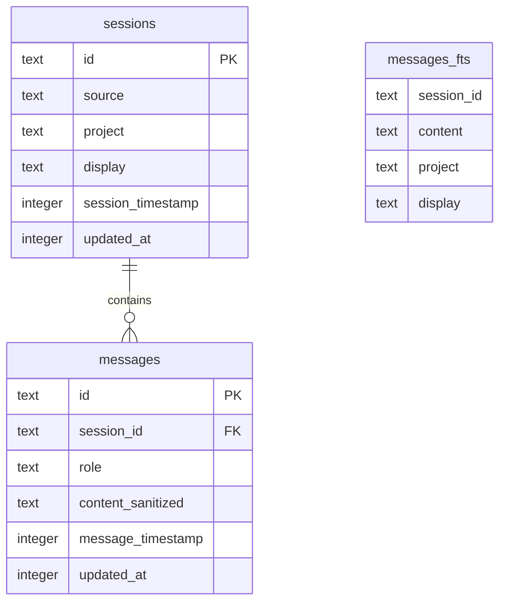

# feat: TrailBase Local Session Search Under 30ms

## Overview

Build a single-user, local-first search experience for Codex/Claude/Factory/Pi session archives where keyword and phrase queries return visible results in under 30ms for typical queries at 100k messages, with first-result preview behavior in the right pane and near-real-time ingest updates.

This plan uses the brainstorm decisions in `docs/brainstorms/2026-02-10-trailbase-codex-session-search-brainstorm.md` as the product source of truth.

## Problem Statement

Current repository capabilities already include:
- local session ingestion from multiple sources (`api/storage.ts:552`, `api/storage.ts:561`)
- live file watching (`api/watcher.ts:74`)
- SSE delivery of session and content updates (`api/server.ts:339`)
- client-side search index in a Web Worker using wa-sqlite FTS (`web/hooks/use-search-index.ts:31`, `web/workers/search-worker.ts:48`)

However, the new target is a TrailBase-centered local architecture with explicit SLOs:
- `<30ms` typical query latency (user-visible)
- `1-2s` append-to-searchable freshness after startup ingest
- first result/session preview behavior aligned with the left-pane search interaction

## Brainstorm Context Used

Found brainstorm from `2026-02-10`: `trailbase-codex-session-search`.

Key carried decisions:
- TrailBase-centered architecture (single backend, avoid dual-system complexity in v1)
- Hybrid ingest (bulk import on startup + incremental tailing)
- Scope limited to keyword/phrase search, highlights, and practical filters
- Single-user local-first app
- Performance-first acceptance criteria (`<30ms`, `1-2s`)

Open questions preserved:
- Final v1 filter set beyond project/date/model
- Behavior when data grows past 100k
- Minimal observability needed to continuously validate SLOs

## Research Consolidation

### Internal Repository Findings

- Existing search UX already maps well to target interaction:
  - left-pane search/filter UI: `web/components/session-list.tsx:244`
  - highlighted snippets in result list: `web/components/session-list.tsx:349`
  - right-pane session rendering/highlighting: `web/app.tsx:290`, `web/components/session-view.tsx:315`
- Existing live update pipeline already supports incremental indexing:
  - file change detection/debounce: `api/watcher.ts:13`, `api/watcher.ts:66`
  - session dirty marking + indexing: `api/server.ts:341`, `api/server.ts:358`
  - SSE content update to client index: `web/app.tsx:174`
- Existing performance-aware client search implementation:
  - worker-off-main-thread query execution: `web/hooks/use-search-index.ts:31`
  - FTS snippet/rank query path: `web/workers/search-worker.ts:92`

### Institutional Learnings

- `docs/solutions/` is not present in this repo (no institutional solution docs to apply directly).
- Relevant local historical context used instead:
  - `IMPLEMENTATION_NOTES.md:54`
  - `docs/plans/archived/2026-02-09-server-primary-hybrid-search-design.md`
  - `docs/brainstorms/archived/2026-02-10-search-performance-and-live-updates-brainstorm.md`

### External Research (TrailBase Docs)

- Record APIs provide CRUD/list/realtime subscription primitives and can be configured over tables/views:
  - https://raw.githubusercontent.com/trailbaseio/trailbase/main/docs/src/content/docs/documentation/apis_record.mdx
  - https://raw.githubusercontent.com/trailbaseio/trailbase/main/docs/src/content/docs/documentation/apis_overview.mdx
- TrailBase type safety is tied to DB-derived JSON schema and recommends generated types:
  - https://raw.githubusercontent.com/trailbaseio/trailbase/main/docs/src/content/docs/documentation/type_safety.mdx
- TrailBase recommends `STRICT` typed schemas for API type safety:
  - https://raw.githubusercontent.com/trailbaseio/trailbase/main/docs/src/content/docs/documentation/models_and_relations.mdx
- Benchmark docs emphasize strong performance and workload-specific benchmarking:
  - https://raw.githubusercontent.com/trailbaseio/trailbase/main/docs/src/content/docs/reference/benchmarks.mdx
  - https://raw.githubusercontent.com/trailbaseio/trailbase/main/docs/src/content/docs/reference/faq.mdx

## Proposed Solution

Adopt a TrailBase-centered local backend while preserving the current proven UI interaction model.

1. Ingest JSONL session data into TrailBase-backed canonical tables.
2. Maintain an FTS index optimized for phrase/keyword retrieval and snippet extraction.
3. Serve search/filter requests from a low-latency local API path.
4. Push incremental updates from tailing pipeline into index within 1-2 seconds.
5. Keep existing left-pane/right-pane UX behavior, including highlights and first-result preview.

YAGNI boundaries for v1:
- no semantic/vector search
- no multi-user concerns
- no cloud sync or remote collaboration features

## Technical Approach

### Architecture

Data flow:
1. Startup bulk importer reads `.jsonl` archives and writes canonical records.
2. Local watcher/tailer tracks append events and pushes incremental updates.
3. Search endpoint executes phrase/keyword query over FTS index.
4. UI sends search term and filters, gets session hits + snippets, auto-selects first result if no user override.

Proposed core schema (TrailBase + SQLite primitives):
- `sessions` (STRICT): metadata per session (id, source, project, display, timestamp, updated_at)
- `messages` (STRICT): normalized message rows (session_id, role, content_sanitized, timestamp)
- `messages_fts` (FTS5 virtual): tokenized searchable text synced from `messages`

### ERD (v1)

### Implementation Phases

#### Phase 1: Foundation and Data Model

- Create TrailBase local runtime wiring and config.
- Define STRICT canonical tables and migration files.
- Define FTS synchronization strategy (trigger-based or write-through upsert path).
- Add ingest benchmark harness for 100k messages.

Planned files:
- `trailbase/schema/001_sessions_messages.sql`
- `trailbase/schema/002_messages_fts.sql`
- `scripts/benchmarks/search_latency_bench.ts`
- `docs/plans/2026-02-10-feat-trailbase-local-session-search-under-30ms-plan.md` (update with measured data)

#### Phase 2: Hybrid Ingestion and Incremental Tailing

- Implement bulk import command for startup load from existing JSONL paths.
- Implement append-aware incremental ingestion with dedupe and idempotent upsert.
- Emit indexing freshness metrics (`append_at`, `indexed_at`) to verify `1-2s`.

Planned files:
- `api/trailbase/importer.ts`
- `api/trailbase/tailer.ts`
- `api/trailbase/repository.ts`
- `api/watcher.ts` (integration point updates)

#### Phase 3: Search API and UI Behavior

- Add search endpoint with phrase/keyword + filters + snippet response.
- Support filters: project, date range, model (v1 required set).
- Ensure first-result auto-selection behavior in right pane when query changes and no manual selection lock.
- Render highlighted snippets in sidebar and preserve in-session highlights.

Planned files:
- `api/trailbase/search.ts`
- `api/server.ts`
- `web/hooks/use-search-index.ts` or `web/hooks/use-trailbase-search.ts`
- `web/components/session-list.tsx`
- `web/app.tsx`

#### Phase 4: SLO Validation and Polish

- Add latency/freshness instrumentation and local diagnostics panel/logging.
- Run repeatable benchmark scenarios at 100k messages.
- Tune indexes/query plan until p95 typical query is <30ms.
- Lock final acceptance tests.

Planned files:
- `scripts/benchmarks/search_latency_bench.ts`
- `scripts/benchmarks/ingest_freshness_bench.ts`
- `docs/perf/trailbase-search-baseline-2026-02-10.md`
- `web/components/search-diagnostics.tsx` (optional debug mode)

## Alternative Approaches Considered

1. Keep current wa-sqlite worker as primary and skip TrailBase now.
- Pros: lowest implementation effort, already fast.
- Cons: diverges from chosen product direction and reduces TrailBase validation.

2. Dual path (TrailBase + existing search engine) from day one.
- Pros: fallback safety.
- Cons: synchronization complexity, harder to reason about latency regressions.

3. TrailBase-centered single path (recommended).
- Pros: simplest long-term architecture aligned with brainstorm decision.
- Cons: migration and tuning work required before SLO confidence.

## SpecFlow Analysis

### User Flow Overview

1. Startup flow:
- User launches app.
- App bulk ingests historical JSONL data.
- Search becomes available when index ready.

2. Query flow:
- User types phrase in sidebar search input.
- Matching sessions appear in <30ms typical latency.
- First matching session appears in right pane with excerpt context.

3. Live update flow:
- New lines appended to active session JSONL.
- Tailer ingests delta and updates index within 1-2s.
- New terms become searchable without restart.

4. Filter flow:
- User applies project/date/model filters with query.
- Result set updates under same latency budget.

### Flow Permutations Matrix

| Dimension | Variant | Required behavior |
|---|---|---|
| Data state | initial ingest running | show indexing status, degrade gracefully, no false “complete” state |
| Data state | ingest complete | full search SLA enforced |
| Query type | single token | <30ms typical |
| Query type | phrase with punctuation (e.g., wa-SQLite) | normalized match + highlighted snippet |
| Session state | stale selected session | auto-select first match unless user explicitly pinned a session |
| Update mode | high-frequency append | batch/coalesce without missing searchable updates |
| Dataset size | >100k messages | defined degraded mode + explicit UX indicator |

### Missing Elements and Gaps

- Error handling gap: startup ingest failure behavior not yet specified.
- UX ambiguity gap: exact “first result auto-select” override rules when user manually selected another session.
- Validation gap: date/model filter semantics and timezone rules not yet fixed.
- Observability gap: no explicit p50/p95/p99 capture path defined yet.
- Growth gap: behavior above 100k not yet committed (degrade rules).

### Critical Questions Requiring Clarification

1. Critical: Should search be disabled until ingest completeness reaches 100%, or enabled progressively with an explicit “partial index” badge?
2. Important: When user has manually selected session B, should new query auto-jump to session A (top hit) or preserve current selection until Enter/click?
3. Important: For date filter, do we filter by session timestamp, message timestamp, or both?
4. Important: If 100k grows to 500k, is preferred strategy pagination-first, shard-by-project, or relaxed SLA with explicit warning?
5. Nice-to-have: Should we expose a hidden diagnostics panel showing query timing and ingest lag in ms?

## Acceptance Criteria

### Functional Requirements

- [ ] User can search keyword/phrase from sidebar input and receive matching sessions with highlighted snippets.
- [ ] Search supports v1 filters: project, date, model.
- [ ] Right pane displays first matching session content excerpt behavior as defined in UX spec.
- [ ] Startup bulk import successfully indexes at least 100k messages from JSONL archives.
- [ ] Incremental tail updates become searchable in 1-2 seconds after append.

### Non-Functional Requirements

- [ ] Typical query latency is `<30ms` at 100k messages (target p95 for representative query set).
- [ ] No main-thread UI jank during search interaction.
- [ ] Index update pipeline is idempotent and resilient to duplicate file events.
- [ ] Local-first operation works without external hosted dependencies.

### Quality Gates

- [ ] Benchmark scripts produce reproducible latency/freshness reports.
- [ ] Integration tests cover startup ingest, query + filters, and live tailing.
- [ ] Manual verification checklist completed for target interaction (`wa-SQLite` example).
- [ ] Documentation updated for setup, ingest behavior, and troubleshooting.

## Success Metrics

- Search latency:
  - p50 <= 15ms
  - p95 <= 30ms
  - p99 <= 50ms
- Freshness latency:
  - p95 <= 2s append-to-searchable
- Throughput:
  - startup indexing of 100k messages completes within acceptable local startup wait budget (target: a few seconds on baseline dev machine)
- UX:
  - zero observed missed matches in spot-check parity test versus canonical JSONL content

## Dependencies and Prerequisites

- Local TrailBase runtime available for development.
- Existing session parsers and sanitization logic reused from:
  - `api/storage.ts:599`
  - `IMPLEMENTATION_NOTES.md:91`
- Existing watcher + SSE pipeline used as integration base:
  - `api/watcher.ts:74`
  - `api/server.ts:339`

## Risk Analysis and Mitigation

- Risk: `<30ms` misses on complex phrase queries.
  - Mitigation: enforce query normalization strategy, precomputed indexes, and bounded result limits.
- Risk: duplicate watcher events cause index churn.
  - Mitigation: idempotent upsert keys and debounce/coalesce window.
- Risk: snippet/result mismatch vs rendered content.
  - Mitigation: reuse existing sanitization parity contract and add parity tests.
- Risk: startup ingest delay feels too long on slower disks.
  - Mitigation: progressive readiness states + persisted index snapshot option (if needed post-v1).

## Resource Requirements

- Engineering: 1 developer for implementation + perf tuning.
- QA: 1 validation pass focused on latency/freshness scenarios.
- Infrastructure: local-only runtime and benchmark datasets (100k+ messages).

## Future Considerations

- Semantic/vector search after phrase/keyword SLOs are consistently met.
- Scale path beyond 100k (partitioning and index lifecycle strategy).
- Optional cross-device sync after local-first quality bar is achieved.

## Documentation Plan

- Add setup guide for TrailBase local runtime and migrations.
- Add ingestion architecture notes and recovery strategy.
- Add performance tuning playbook and benchmark interpretation guide.

Planned docs:
- `docs/perf/trailbase-search-baseline-2026-02-10.md`
- `docs/architecture/trailbase-ingest-and-search.md`
- `README.md` (local setup section)

## AI-Era Considerations

- Keep benchmark/test gates explicit because rapid AI-assisted implementation can hide performance regressions.
- Require human verification of SLO charts before sign-off.
- Record prompt/checklist used for reproducible local performance validation.

## References and Research

### Internal References

- `docs/brainstorms/2026-02-10-trailbase-codex-session-search-brainstorm.md`
- `api/server.ts:297`
- `api/server.ts:304`
- `api/server.ts:339`
- `api/watcher.ts:74`
- `api/storage.ts:552`
- `web/hooks/use-search-index.ts:31`
- `web/workers/search-worker.ts:87`
- `web/components/session-list.tsx:244`
- `web/components/session-list.tsx:349`
- `web/app.tsx:290`
- `IMPLEMENTATION_NOTES.md:54`

### External References

- TrailBase Record APIs:
  - https://raw.githubusercontent.com/trailbaseio/trailbase/main/docs/src/content/docs/documentation/apis_record.mdx
- TrailBase Endpoints overview:
  - https://raw.githubusercontent.com/trailbaseio/trailbase/main/docs/src/content/docs/documentation/apis_overview.mdx
- TrailBase Type Safety:
  - https://raw.githubusercontent.com/trailbaseio/trailbase/main/docs/src/content/docs/documentation/type_safety.mdx
- TrailBase Models and Relations:
  - https://raw.githubusercontent.com/trailbaseio/trailbase/main/docs/src/content/docs/documentation/models_and_relations.mdx
- TrailBase Benchmarks:
  - https://raw.githubusercontent.com/trailbaseio/trailbase/main/docs/src/content/docs/reference/benchmarks.mdx
- TrailBase FAQ:
  - https://raw.githubusercontent.com/trailbaseio/trailbase/main/docs/src/content/docs/reference/faq.mdx

### Related Work

- `docs/plans/archived/2026-02-09-client-side-search-design.md`
- `docs/plans/archived/2026-02-09-server-primary-hybrid-search-design.md`
- `docs/brainstorms/archived/2026-02-10-search-performance-and-live-updates-brainstorm.md`
